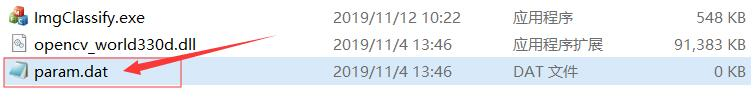
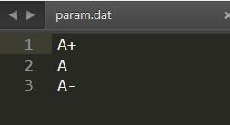
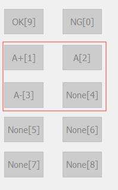

**中文 | [English](./ReadMe_en.md)**

# 图像分类软件

------

> * 可以通过修改param.dat文件来修改分类的快捷键。
> 
> 
>
> * 打开param.dat输入以下内容：
>
> 
>
> * 然后打开程序，可以看到快捷键的部分修改了。
>
> 

------

# 隐藏的按钮

> <kbd>Ctrl</kbd>+<kbd>Z</kbd>可以撤销上一步操作。
>
> <kbd>Ctrl</kbd>+<kbd>S</kbd>可以保存当前进度，也就意味着你不能再撤销了。
>
> 字母<kbd>O</kbd>和数字<kbd>9</kbd>都是划分到**OK**。
>
> 字母<kbd>N</kbd>和数字<kbd>0</kbd>都是划分到**NG**。

---