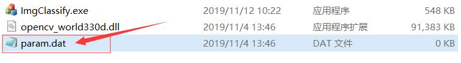

**[中文](./ReadMe.md) | English**

# Image Classify Software

------

> * You can use edit "param.dat" file to change the shortcut key of the classify button.
> 
> 
>
> * open param.dat file and input：
>
> 
>
> * Then, open the process，you can see the change of shortcut key.
>
> 

------

# TIPS

> <kbd>Ctrl</kbd>+<kbd>Z</kbd> can revoked on step operation.
>
> <kbd>Ctrl</kbd>+<kbd>S</kbd>can save the current schedule, but it also means that you can't undo.
>
> Letter <kbd>O</kbd> or Number <kbd>9</kbd> all going to **OK**。
>
> Letter <kbd>N</kbd> or Number <kbd>0</kbd> all going to **NG**。

---